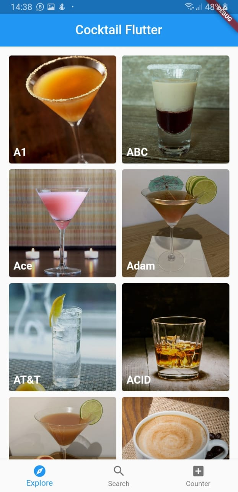
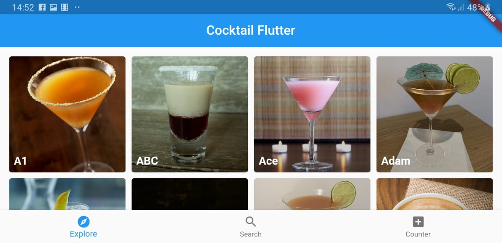
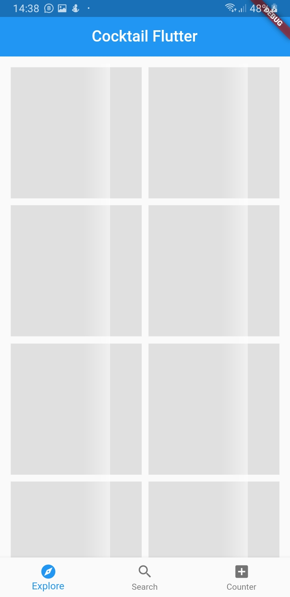
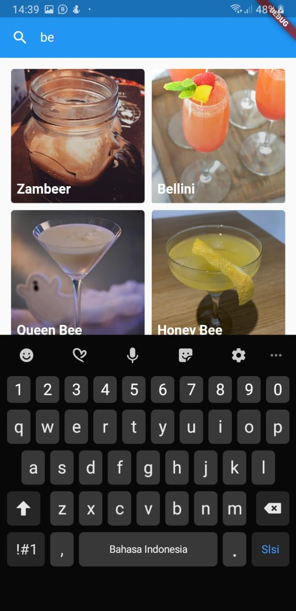
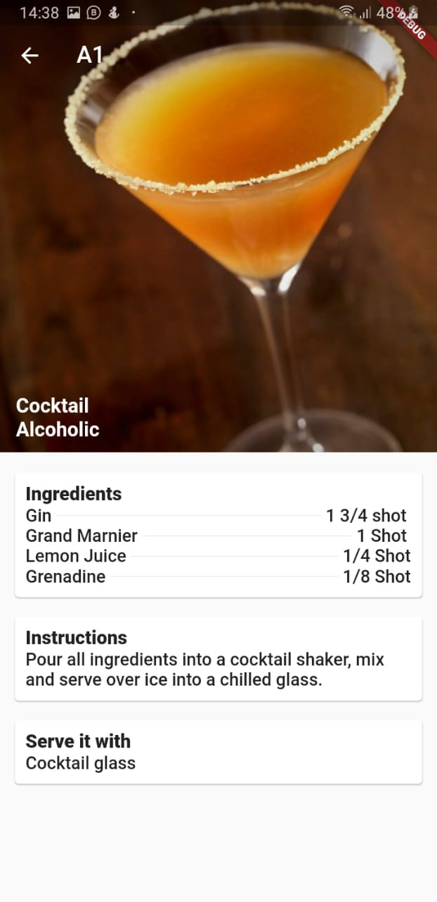
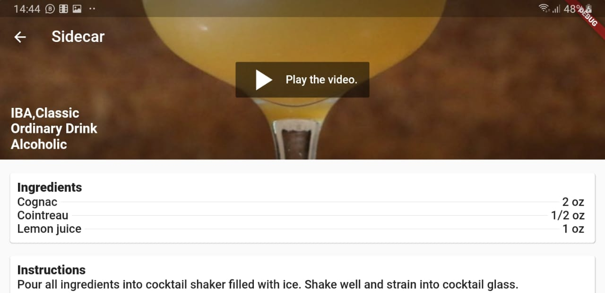
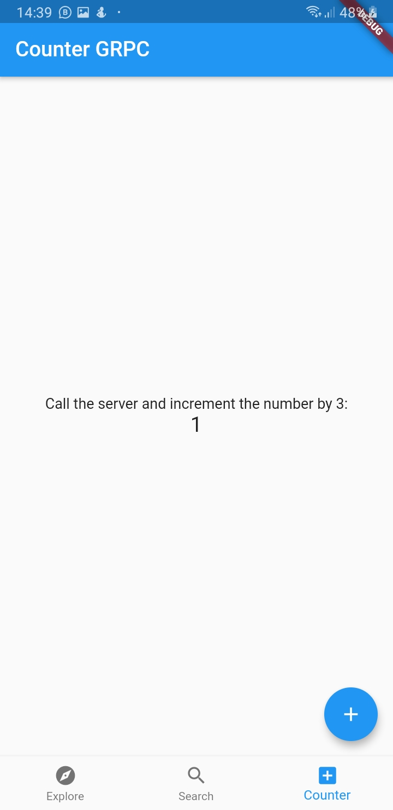

# cocktail_flutter

A Cocktail app using flutter.

## Technologies

This project is a starting point for a Flutter application.

Using a few tech stack:

- RxDart
- Bloc
- gRPC

For cocktails data, this project using [CocktailDb](https://www.thecocktaildb.com/), 
and for gRPC sample using my own [golang sample code](https://github.com/abrahamSN/cocktail_server).

## Screenshot

- Explore

- Search

- Details

- Counter gRPC

